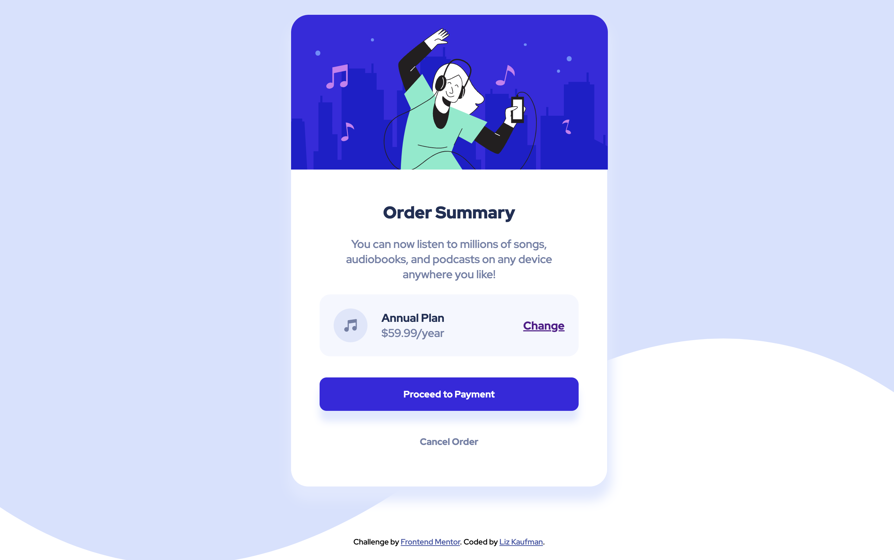

# Frontend Mentor - Order summary card solution

This is a solution to the [Order summary card challenge on Frontend Mentor](https://www.frontendmentor.io/challenges/order-summary-component-QlPmajDUj). Frontend Mentor challenges help you improve your coding skills by building realistic projects.

## Table of contents

- [Overview](#overview)
  - [The challenge](#the-challenge)
  - [Screenshot](#screenshot)
  - [Links](#links)
- [My process](#my-process)
  - [Built with](#built-with)
  - [What I learned](#what-i-learned)
  - [Continued development](#continued-development)

## Overview

### The challenge

Users should be able to:

- See hover states for interactive elements
- Use the component on desktop and mobile

### Screenshot

### Links

- [Live URL](https://github.com/lizkaufman/front-end-mentor_order-summary-component)
- [Solution page on Frontend Mentor](https://www.frontendmentor.io/solutions/order-summary-component-BO1NJzICAY)

## My process

### Built with

- Semantic HTML5 markup
- Flexbox
- CSS variables
- Media queries

### What I learned

Through this project, I practiced:

- Getting better at using the elements' hierarchy when selecting
- Working to a design, eyeballing distances, sizes, etc. just from pictures
- Box shadows

### Continued development

After this project, I want to get better at:

- Writing more concise CSS
- Getting better at spacing rather than stabbing in the dark with margins and paddings a bit haphazardly
- Not using flexbox as a catch-all/crutch
- Being more mobile-first
- Practicing using a tool or framework (like Tailwind), not just vanilla CSS
